# Explicación del proyecto:
Es un proyecto CRUD realizado con la pila MEAN (MongoDB, ExpressJS, AngularJS, NodeJS).
<br>
<br>
El sistema tan solo tendrá dos roles: 
  - **Usuario básico**: es el usuario anónimo que accede a la web sin registrar. Solo tiene permisos para mostrar listados.
  - **Usuario administrador**: es el usuario que se registra en la aplicación. Puede realizar las operaciones de alta, edición y borrado.
<br>
Por defecto cuando entras en la aplicación tendrás los privilegios de un usuario básico hasta que el usuario haga un login correcto con el usuario / password admin / admin. En ese momento pasara a ser un usuario administrador y podrá realizar operaciones de alta, baja y modificación.

# Estructura general de la aplicación:
**Una cabecera superior(NavBar) que contendrá:**
  - El logo y nombre de la tienda.
  - Un enlace a cada uno de los CRUD del sistema.
  - Un botón de Signin

# Datos Login:
**Email:** admin@ludoteca.com
<br>
**Password:** Admin1234

# Instalación y ejecución del proyecto:
**Instalar dependencias en Backend y FontEnd:**
<br>
En la carpeta /backend:
```bash
cd backend
npm install
```
En la carpeta /frontend:
```bash
cd frontend
npm install
```
**Ejecución:**
<br>
En la carpeta /backend:
```bash
cd backend
npm run dev
```
En la carpeta /frontend:
```bash
cd frontend
ng serve -o
```

# Imágenes:
**COMPONENTE CATÁLOGO:**<br>
**Catálogo:**
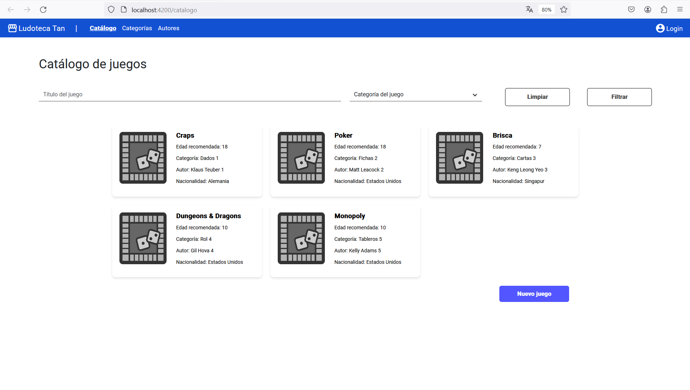<br>
<br>
**Catálogo filtro:**
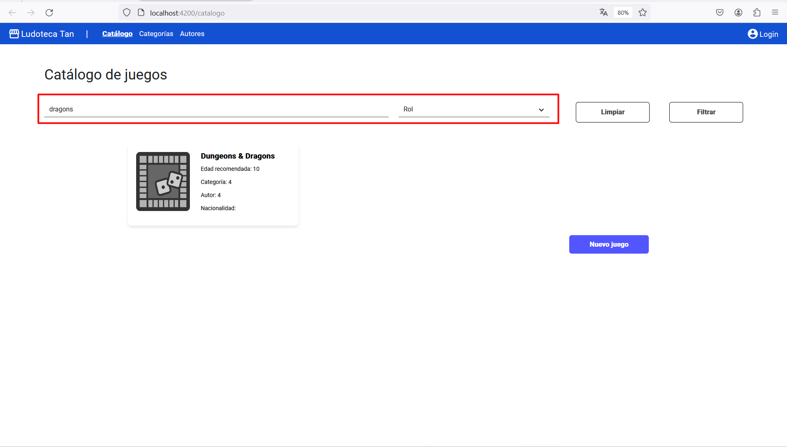<br>
<br>
**Crear nuevo juego:**
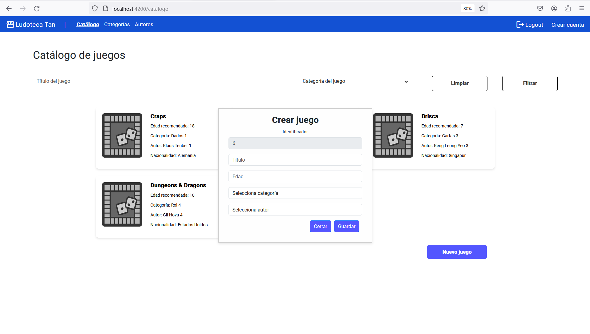<br>
<br>
**Edición juego:**
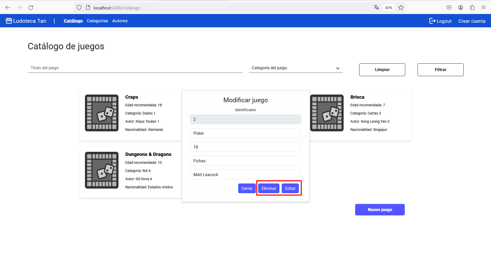<br>
<br>

**COMPONENTE CATEGORÍAS:**<br>
**Categorías:**
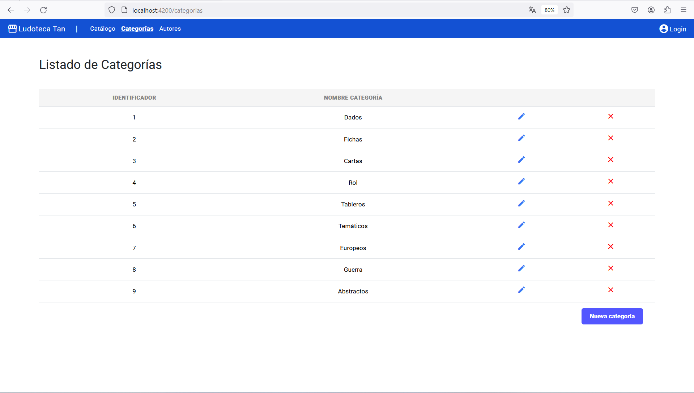<br>
<br>
**Nueva categoría:**
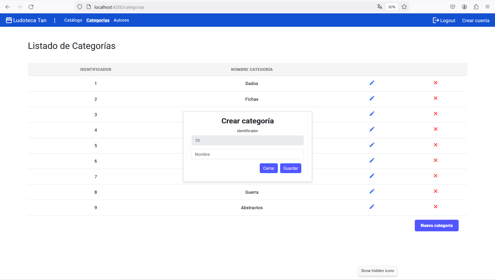<br>
<br>
**Edición categoría:**
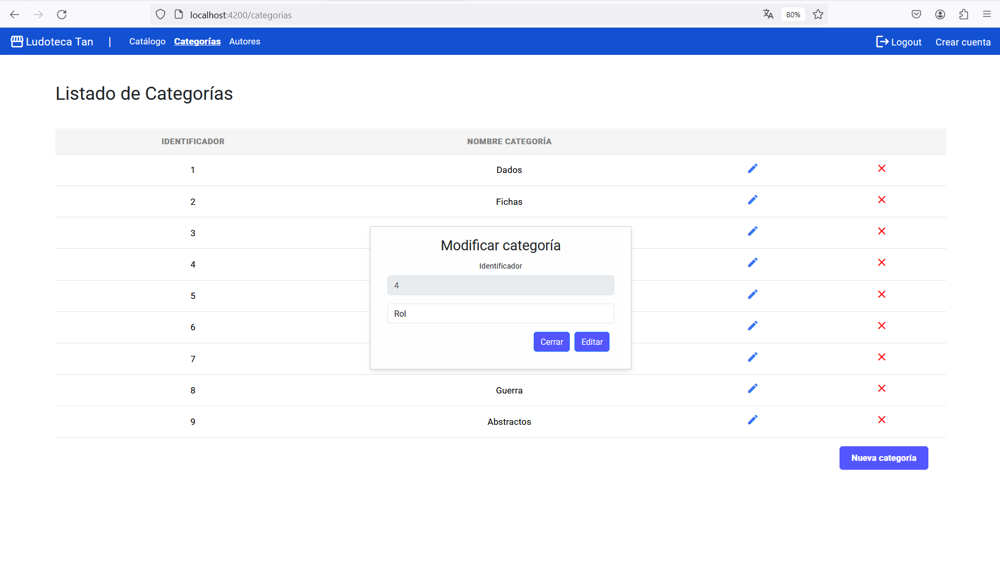<br>
<br>

**COMPONENTE AUTORES:**<br>
**Autores:**
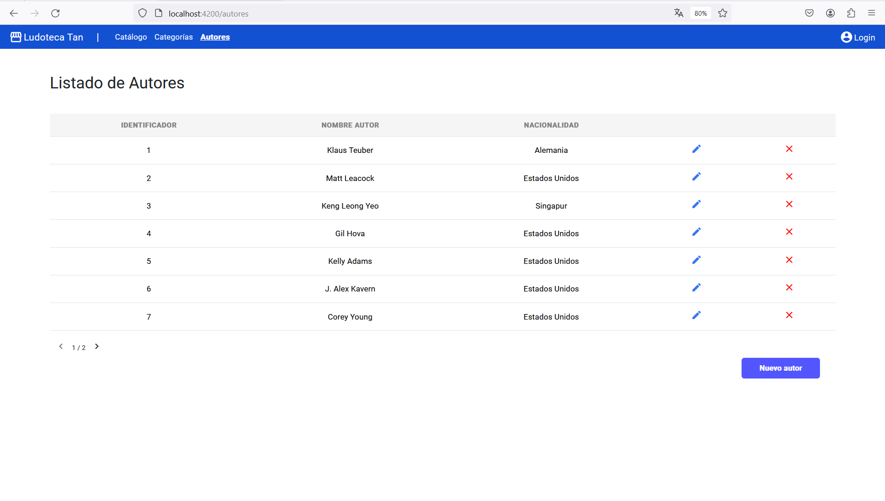<br>
<br>
**Nuevo autor:**
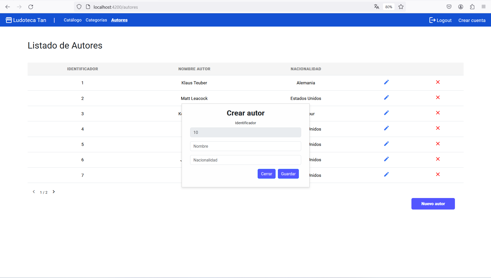<br>
<br>
**Edición autor:**
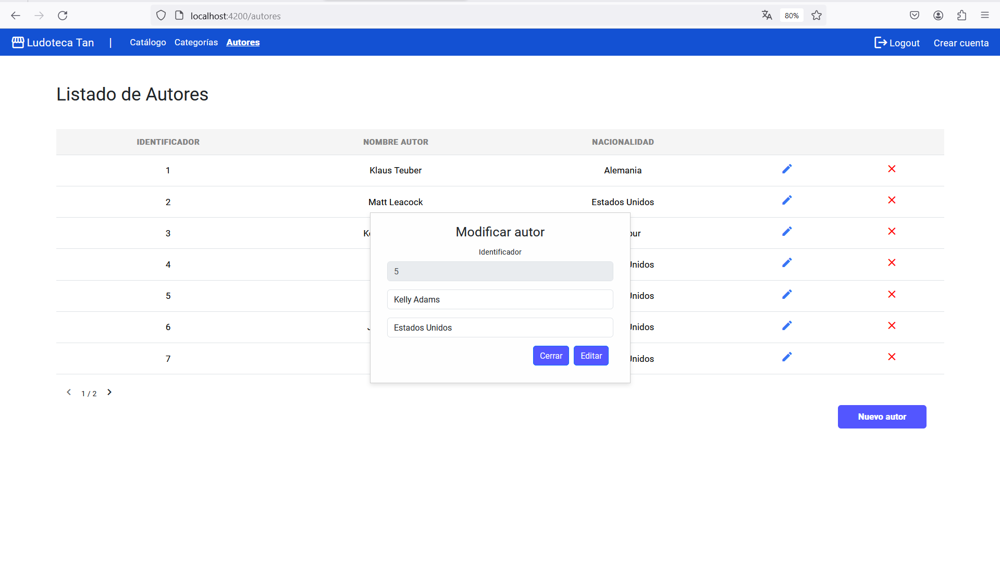<br>
<br>

**COMPONENTE LOGIN:**<br>
**Login:**
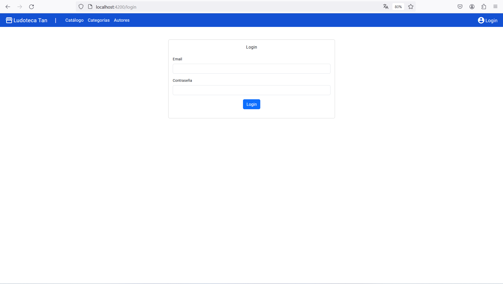<br>
